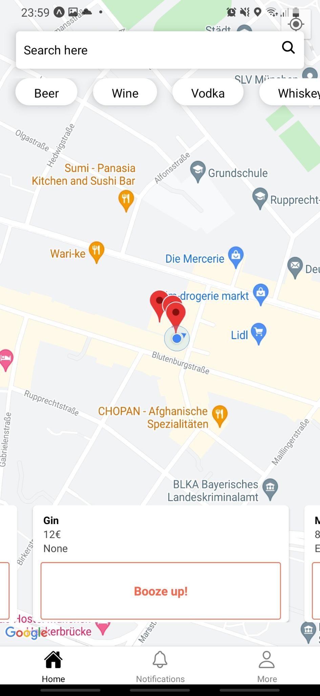

  <h1>BoozeUp</h1>
  

  
    
    
  
   
  

    <a href="#calling-about"><b>What is this?</b></a>
    &nbsp;&nbsp;&mdash;&nbsp;&nbsp;
    <a href="#eyes-preview"><b>Preview</b></a>
    &nbsp;&nbsp;&mdash;&nbsp;&nbsp;
    <a href="#book-documentation"><b>Docs</b></a>
  

   

---
## :calling: About
BoozeUp - Buy and Sell Booze convienently and easily using an App. No hassle to reach the stores before they close or drive too far to get booze in the evening. Locate Booze in your Area and keep the party running!

## :eyes: Preview

1. Download the Expo App in the Playstore/Appstore
2. Open the App and simply follow the instructions to make an Account
3. Scan the QR code in the [link](https://expo.dev/@maharajamihir/BoozeUp) below:
    - https://expo.dev/@maharajamihir/BoozeUp
4. Enjoy! For Issues or Pull Requests: [here](https://github.com/maharajamihir/BoozeUp)

## :book: Documentation
A documentation about our engineering and development process of this App can be found [here](./documentation.md).

